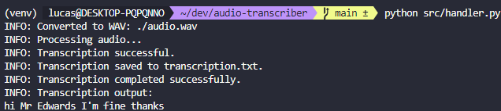

<h1 align="center"> Audio Transcriber </h1>

  

  
  
  

  

  

## 💻 Objectives

A helper tool for transcribing speech to text using Speech Recognition.
For analysis, we can input an MP3 file and receive the transcribed text in the target language.

### Execution preview:

  

## 🚀 Techs

The analysis is being performed with the following technologies:

- [Python3](https://www.python.org/)
- [SpeechRecognition](https://pypi.org/project/SpeechRecognition/)

